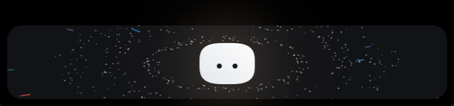

<div align="center">


# Coucou for Windows and Linux

**Mochi doesn't get a notch on a PC — so it lives at the top of your screen instead.** On Windows 10/11 and on Linux (built for CachyOS / Arch with KDE Plasma on Wayland).

Approve Claude Code permissions, watch your session work, drop a file, chat with Claude, keep an eye on your services — without leaving what you're doing.


</div>



---

## Install

### Linux (CachyOS / Arch)

```bash
git clone https://github.com/rebanne1523/coucou.git
cd coucou/desktop/packaging/arch
makepkg -si
```

That builds the app from your checkout and installs `coucou`, `coucou-hook`, a
launcher entry and the icons. Start it from the application menu or with
`coucou`; **Settings… → General → Launch at startup** adds it to your session.

Other distributions: see [Build it yourself](#build-it-yourself). A `.deb`, `.rpm`
and AppImage come out of `npm run pack` too.

**KDE Plasma on Wayland** is what it was built and tested for: the island is a
[`wlr-layer-shell`](https://wayland.app/protocols/wlr-layer-shell-unstable-v1)
surface, so it sits above windows at the very top edge, never takes focus, and the
space around it is click-through. Sway, Hyprland and other wlroots compositors
work the same way. **GNOME's Mutter has no layer-shell**: there the island falls
back to a plain always-on-top window, which Wayland lets the compositor place
wherever it likes — run it under XWayland (`GDK_BACKEND=x11 coucou`) for the
top-centre position.

API keys need a **Secret Service** — on Plasma that is KDE Wallet (System Settings
→ KDE Wallet, with "Secret service" on), elsewhere GNOME Keyring. Without one,
Coucou says so when you save a key instead of writing it to disk.

### Windows

The downloadable installer is **temporarily unavailable**. Microsoft Defender
wrongly flags the unsigned installer as malware (`Trojan:Win32/Wacatac.H!ml`, a
machine-learning false positive). A report is under review at Microsoft, and the
installer will be published again once it is cleared and code-signed.

Until then, [build it yourself](#build-it-yourself): it takes a few minutes and
installs for the current user only — no admin prompt.

## Using it


| What you do | What happens |
|---|---|
| Move the mouse to the very top-centre of the screen | Mochi peeks out |
| Click the small island | It opens |
| Click Mochi | It gets annoyed. Three times in a row and it goes dizzy |
| Rest the pointer on Mochi for two seconds | Hearts |
| Drag a file onto the island | Mochi turns into a box, swallows it, then offers to answer questions about it |
| `Esc` | Closes the island |
| Tray icon | Open, Settings…, Pause, Quit |

Everything else happens on its own: a Claude Code permission request opens the
island with **Deny / Allow**, a finished session shows what it did, and
your integrations sit in the coloured pills next to Mochi.

## Claude Code


Open **Settings… → Claude Code → Install hooks…**. You get the exact diff of what
will change in `%USERPROFILE%\.claude\settings.json`, the path of the dated backup
that will be taken, and nothing is written until you click. Your own hooks are
never touched, and uninstalling removes only Coucou's entries.

The relay is a tiny executable, `coucou-hook.exe` (`coucou-hook` on Linux), copied
to `%LOCALAPPDATA%\Coucou\bin\` (`~/.local/share/coucou/bin/`) at launch. It
talks to the app over a named pipe on Windows and a Unix socket
(`$XDG_RUNTIME_DIR/coucou.sock`, owner-only) on Linux, and each side checks the
other belongs to the same user. It is given 300 ms to reach Coucou and
exits cleanly if the app is closed, slow or crashed — **a Claude Code session is
never blocked or slowed down by Coucou.** If nobody answers a permission request
in time, Coucou stays quiet and Claude Code asks in the terminal as usual.

It works from any terminal — Windows Terminal, PowerShell, VS Code, Git Bash,
Konsole, kitty, anything.

## Chat and keys

**Settings… → Claude** takes your Anthropic API key. Keys live in the **Windows
Credential Manager** (the **Secret Service** — KDE Wallet or GNOME Keyring — on
Linux), never on disk and never in the interface — the island can
only ask whether a key exists. Same for every integration key.

No telemetry. The only network requests Coucou makes are to the services you
configure yourself.

## Supabase

Add **Supabase** in **Settings… → Integrations** to get a pill that watches a
project. Every field is optional except the URL:

| Field | What it gives you |
|---|---|
| **Project URL** (`https://<ref>.supabase.co`, or just the ref) | required |
| **Public key** (anon / publishable) | whether the Auth API answers, and how fast |
| **Access token** (`sbp_…`) | project status, per-service health (db, auth, rest, realtime, storage, pooler) and Edge Function 5xx errors from the last hour |

Mochi alerts when a service goes down (or comes back) and when a new Edge Function
error appears. The first check after launch only fills the card, like every other
pill.

- Never paste a `service_role` key: the public key is all this needs.
- The access token covers your whole Supabase account, not one project. Create one
  just for Coucou in the Supabase dashboard (Account → Access Tokens) and revoke
  it if you stop using the app. It is kept in the secret store and only ever sent
  to `api.supabase.com`.
- **Unverified against a live project.** The Management API calls were written
  from the API reference without being able to reach it from the development
  environment, so only the public-key check and the response parsing were
  exercised (against a local stand-in). If the card shows a note about logs or an
  odd status, that is the first place to look — see
  `src-tauri/src/integrations/supabase.rs`.

## Build it yourself

**Windows** — you need [Rust](https://rustup.rs), [Node 20+](https://nodejs.org),
and the **MSVC build tools** (Visual Studio Build Tools with "Desktop development
with C++"). WebView2 ships with Windows 10/11.

**Linux** — Rust, Node 20+, and the development packages (Arch / CachyOS):

```bash
sudo pacman -S --needed rust nodejs npm pkgconf webkit2gtk-4.1 gtk3 gtk-layer-shell \
  libayatana-appindicator dbus xdg-utils
# Debian / Ubuntu 24.04
sudo apt install libwebkit2gtk-4.1-dev libgtk-3-dev libgtk-layer-shell-dev libdbus-1-dev \
  libayatana-appindicator3-dev librsvg2-dev pkg-config build-essential
```

```bash
cd desktop
npm install
npm run tauri dev      # live-reloading development build
npm run pack           # Windows: the installer; Linux: .deb, .rpm and AppImage → desktop/release/
```

`npm run dev` alone serves the front end in an ordinary browser, which is enough
to work on the island's looks. It also serves `dev/upload-preview.html`, which
replays the whole file-drop choreography on a loop — the one part of the UI that
otherwise needs a real drag from Explorer to see. Neither page ships in the app.

On Windows `npm run pack` leaves two files in `desktop/release/`, the same names
the release workflow publishes:

```
Coucou-Windows-X.Y.Z-setup.exe    the versioned installer
Coucou-Windows-setup.exe          the same file under the rolling name
```

On Linux it leaves `Coucou-Linux-X.Y.Z-<arch>.deb` / `.rpm` / `.AppImage`.

Installing is optional — `target/release/coucou.exe` (`coucou` on Linux) runs on
its own. There is no
window in the taskbar and no console: the island at the top of the screen and the
Mochi in the notification area are the whole app, and Quit lives in its menu. (The
tray icon needs a StatusNotifier host — Plasma has one built in.)

The 28 sounds are the macOS app's own files; they are never duplicated in this
folder. The path is declared once, in `SOUNDS_DIR` at the top of
`vite.config.ts` — when they move to `shared/sounds/`, change that one line.

The app icon and the tray icon are drawn in code, like Mochi itself:

```bash
npm run icons          # regenerates src-tauri/icons from scripts/gen-icons.mjs
```

### Layout

```
desktop/
  src/                 island front end (TypeScript, no framework)
    mochi/             Mochi and the launch greeting, in Canvas 2D
    island/            state machine, hooks, integrations
    views/             every island view
    settings/          the settings window
  src-tauri/           Rust backend: window, relay, Claude API, pollers
    src/island/        per-OS island window (win.rs: Win32 · linux.rs: layer-shell)
    src/relay/         per-OS hook transport (named pipe · Unix socket)
  hook/                coucou-hook, the Claude Code relay
  packaging/           PKGBUILD and desktop entry for Linux
  scripts/             icon generator
```

### Log

`%LOCALAPPDATA%\Coucou\coucou.log` (`~/.local/share/coucou/coucou.log` on Linux) — hook events, permission decisions, poller
problems. It stays on your machine.

## What's different from the Mac version

- No notch, so the island lives at the top centre of the screen and retracts into
  the top edge instead of hiding in a notch.
- Permission approval works from **any** terminal; the Mac build only listens to
  VS Code sessions.
- Not in this version: sending a file by email, dragging Mochi onto a window to
  attach it as context, and jumping to a specific terminal window — "Open
  terminal" opens the working folder in VS Code when `code` is on your `PATH`.
- Cal.com shows the next bookings as a list rather than the Mac's calendar.
- Supabase is only in this port (see above).

### Linux specifics

- **No pointer polling.** Wayland never tells a client where the global cursor
  is, so the island listens to the pointer events its own window receives, and the
  window's *input region* is cut to the island's shape: clicks anywhere else go
  straight to the window underneath, and nothing runs while the pointer is away.
- **"Display under the cursor" is Windows-only**, for the same reason. On Wayland
  the compositor decides which output the island appears on (the focused or primary
  one).
- **Typing in the chat** asks the compositor for on-demand keyboard focus only
  while the chat field is open; the rest of the time the island never takes it.
- If the window comes up blank or without transparency on an NVIDIA GPU, try
  `WEBKIT_DISABLE_DMABUF_RENDERER=1 coucou` — a known WebKitGTK quirk, not specific
  to Coucou.
